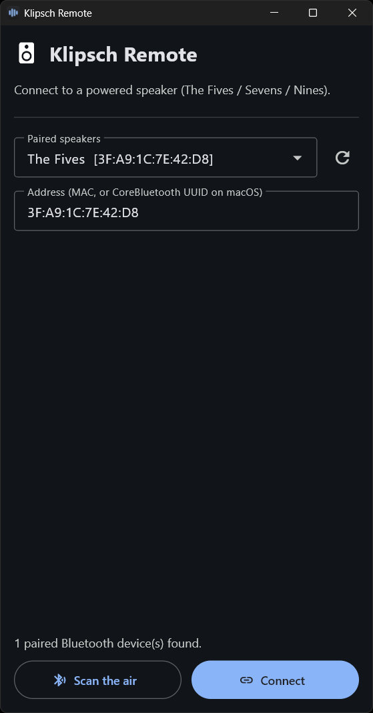
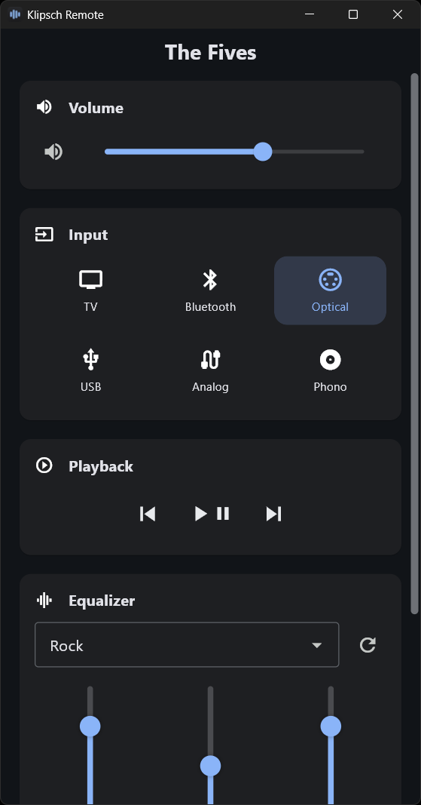
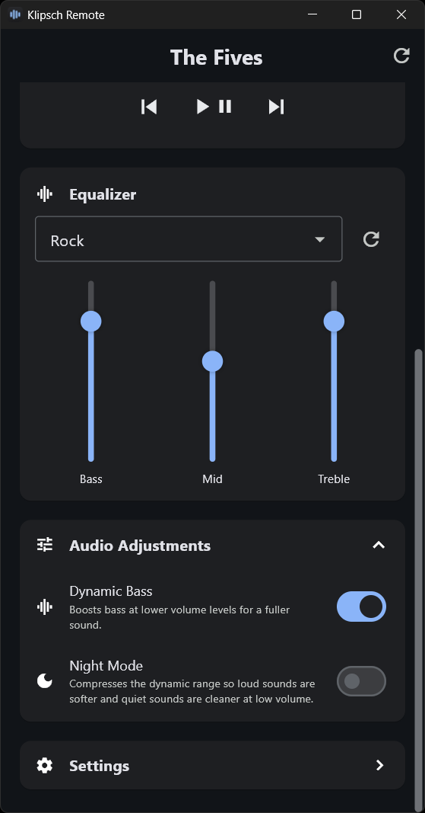
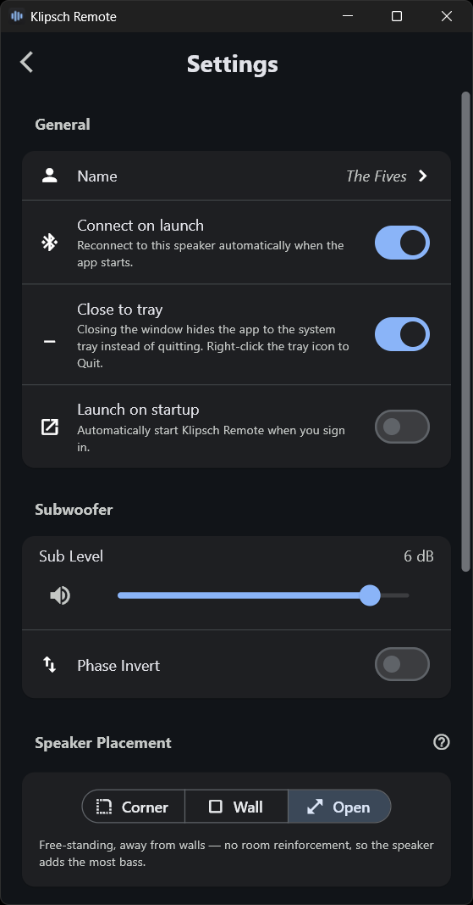
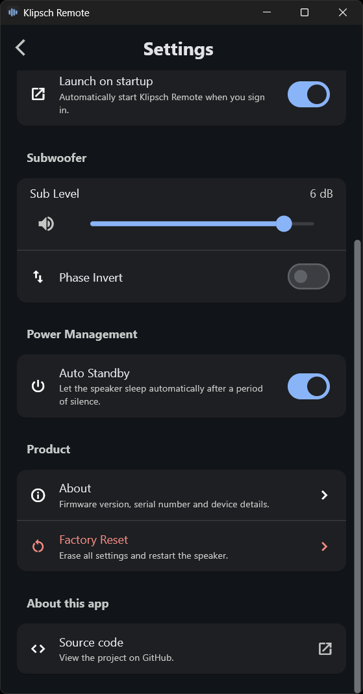
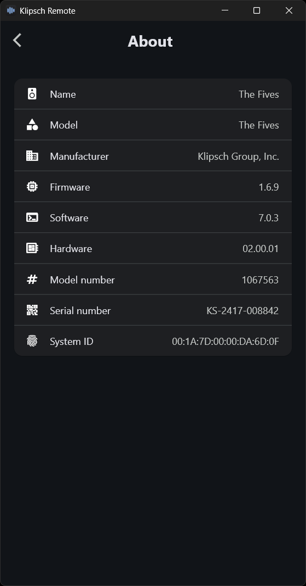

<div align="center">


# KlipschRemote

**Control your Klipsch powered speakers from your computer — over Bluetooth LE.**
The Fives · The Sevens · The Nines (incl. McLaren) · Windows · Linux · macOS

[](https://github.com/Nixer1337/KlipschRemote/actions/workflows/tests.yml)
[](https://github.com/Nixer1337/KlipschRemote/actions/workflows/build.yml)
[](https://github.com/Nixer1337/KlipschRemote/releases/latest)
[](LICENSE)


</div>

---

A desktop remote and Python library for Klipsch powered speakers. Volume, input,
3-band EQ, mute, sound modes, transport and rename — all over the speaker's
native BLE control protocol, with one code path for every OS. Ships as a friendly
GUI, a CLI, an importable async library, and a **no-install browser app**
([Web Bluetooth](web/README.md)).

## 📸 Screenshots

<div align="center">

| Connect | Remote | Equalizer |
|:---:|:---:|:---:|
|  |  |  |
| **Settings** | **Settings (more)** | **About** |
|  |  |  |

</div>

## ⬇️ Install

**Web app — nothing to install** — open
[**the hosted remote**](https://nixer1337.github.io/KlipschRemote/) in **Chrome,
Edge or Opera** (desktop or Android) and connect over Web Bluetooth. No download,
no Python. Firefox and iOS/Safari don't support Web Bluetooth. Details and
self-hosting: [`web/`](web/README.md).

**Windows app** — grab the installer from the
[**latest release**](https://github.com/Nixer1337/KlipschRemote/releases/latest)
(`KlipschRemote-Setup.exe`), run it, done. Per-user install, no admin needed.

**Linux app** — grab `KlipschRemote-x86_64.AppImage` from the
[**latest release**](https://github.com/Nixer1337/KlipschRemote/releases/latest),
`chmod +x` it and run — a single portable file, no install, works on essentially
any modern x86-64 distro (pair the speaker as a Bluetooth audio device first). It
ships the static AppImage runtime, so no host `libfuse2` is required; if mounting
ever fails on an unusual setup, run it with `--appimage-extract-and-run`.

**From source** (any OS):

```sh
pip install flet bleak          # + winrt-Windows.Devices.Bluetooth on Windows
git clone https://github.com/Nixer1337/KlipschRemote.git
```

> [!IMPORTANT]
> Pair the speaker with your OS as a Bluetooth **audio** device first. Never
> pair/unpair it as an LE-only device — that breaks control.

## ▶️ Run

```sh
python -m klipsch_remote        # desktop GUI
python -m klipsch_ble           # CLI / interactive REPL
python -m klipsch_ble status    # one-shot status
```

**Web version** — just open
[the hosted page](https://nixer1337.github.io/KlipschRemote/), or serve the
folder yourself (Web Bluetooth needs HTTPS or `localhost`):

```sh
python -m http.server 8000 --directory web    # then open http://localhost:8000
```

Library use:

```python
import asyncio
from klipsch_ble import KlipschClient

async def main():
    async with KlipschClient("AA:BB:CC:DD:EE:FF") as spk:
        await spk.set_input("optical")
        await spk.set_volume_percent(40)
        await spk.set_eq("bass", +3)

asyncio.run(main())
```

## 🛠️ Build native bundles

Both builds compile a real Flutter app via `flet build` (the executable *is* the
program), so the window/taskbar icon and app identity are baked in.

On a **fresh Windows machine** you need the toolchain once: Git, Python 3.12,
the VS C++ Build Tools, and (for the installer) Inno Setup, plus Windows
Developer Mode enabled (Flutter needs it for plugin symlinks). Then install the
pinned deps from [`requirements.txt`](requirements.txt) with
`python -m pip install -r requirements.txt`. All dependency versions are frozen,
so builds are reproducible.

| Target | Command | Output |
|---|---|---|
| Windows | `build_app.bat` (add `-NoInstaller` for the folder bundle only) | `dist_installer\KlipschRemote-Setup.exe` + `dist_app\` |
| Linux | `./build_app.sh` *(on Linux)* | `dist_installer/KlipschRemote-x86_64.AppImage` + `dist_app/KlipschRemote/` |

On Windows the build also compiles the Inno Setup installer by default (needs
`winget install JRSoftware.InnoSetup`); `-NoInstaller` stops at the `dist_app\`
folder bundle. `flet build linux` can't cross-compile, so build the AppImage on
Linux. From Windows, run `build_app_linux.bat` to do it in a Docker container
instead. CI
([`build-linux.yml`](.github/workflows/build-linux.yml)) builds it on Ubuntu
22.04 and attaches the AppImage to the release on every `v*` tag.

## 📦 What's inside

| Component | Description |
|---|---|
| [`klipsch_ble`](klipsch_ble/README.md) | Async BLE library + CLI — the engine |
| [`klipsch_remote`](klipsch_remote/README.md) | Flet desktop GUI on top of it |
| [`web`](web/README.md) | Browser remote over Web Bluetooth — static page, no install, [hosted on Pages](https://nixer1337.github.io/KlipschRemote/) |

## 📝 License & legal

Licensed under the **[Apache License 2.0](LICENSE)** — see also [`NOTICE`](NOTICE).

Unofficial, independent project — **not** affiliated with or endorsed by Klipsch
Group, Inc.; trademarks belong to their owners. Built for **interoperability**, on
top of the MIT-licensed [`fives-api`](https://github.com/ssalaues/fives-api).
Provided **"AS IS", without warranty of any kind**.
